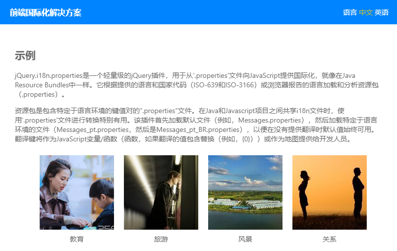
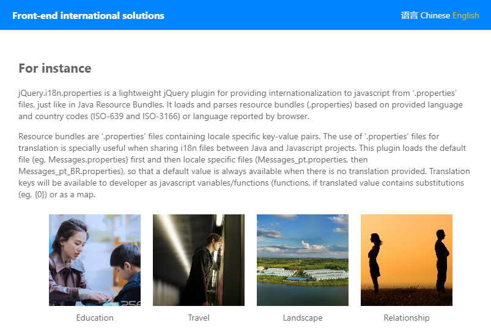

## 前端国际化解决方案 - HTML

### API
> [jquery-i18n-properties](https://github.com/jquery-i18n-properties/jquery-i18n-properties)

### SETTING
```
jQuery.i18n.properties({
    name: 'Messages', //资源文件名称  
    path:'assets/language/', //资源文件路径  
    language: tmp_lang,  
    cache: false,  
    mode:'map', //用Map的方式使用资源文件中的值  
    callback: function() {
        //加载成功后设置显示内容
        jQuery.i18n.prop('msg_hello');
    }  
});  
```
> 资源文件
```
//language/Messages_zh.properties
msg_hello = 你好
msg_world = 世界

//language/Messages_en.properties
msg_hello = Hello
msg_world = World
```

### 关于图片
> 如果图片上有文字描述，就必须要图片放入对应语言的文件夹，然后进行读取
```
assets/images/zh/1.jpg
assets/images/en/1.jpg
```

### 常见问题
* [setting is not a function](https://github.com/jquery-i18n-properties/jquery-i18n-properties/issues/90)
* [browserLang is not a function](http://www.cnblogs.com/zengjfgit/p/7457524.html)


### 关于示例
> 需要在服务器环境下预览


